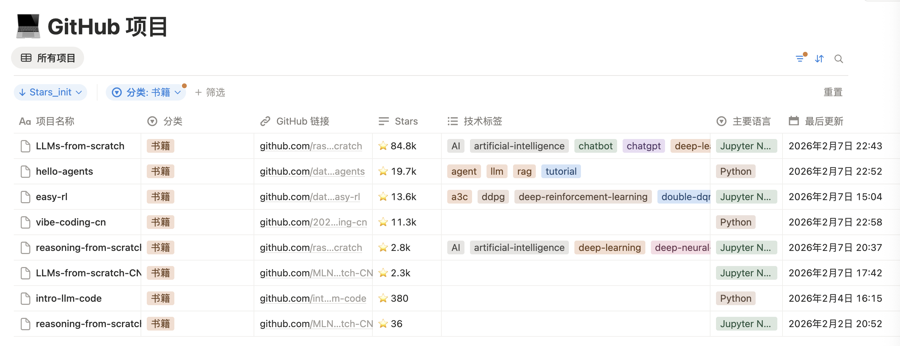

# GitHub -> Notion 项目同步工具

自动同步 GitHub 项目信息到 Notion 数据库，当前以 `data/projects.xlsx` 作为项目配置源。

## 在线 Notion 看板与截图

- Notion 链接：
  https://gray-color-594.notion.site/8bffbc8c93714bc6b48454e776bdcab9?v=f22d4cd734fa40e7b9fecb347ecd26c8



> 请将截图文件保存为 `docs/notion-view.png`（与 README 中的路径保持一致）。

## 功能

- 自动同步 GitHub 仓库信息到 Notion
- 同步 Stars、Forks、Watchers、Issues、Topics 等字段
- 支持 `create_only` / `update_only` / `all` 三种模式
- 支持按 Notion 的“分类”字段反向对齐本地分类（可选）
- 配置文件使用 Excel（`data/projects.xlsx`）

## 文件结构

```text
notion_github/
├── scripts/
│   ├── sync.py                           # 主同步脚本
│   ├── reconcile_categories_from_notion.py # 按 Notion 分类回写本地分类
│   ├── project_store.py                  # Excel 存储层
│   └── notion_test.py                    # Notion 连接测试脚本
├── data/
│   ├── projects.xlsx                     # 项目配置文件（主）
│   └── projects.json                     # 旧版 JSON（可作为迁移来源）
├── docs/
│   ├── notion-view.png                   # Notion 看板截图
│   └── solution.md                       # 方案文档
├── Makefile                              # 常用命令入口
├── requirements.txt
├── .env.example
├── .env
└── QUICKSTART.md
```

## 快速开始

### 1. 安装依赖

```bash
pip install -r requirements.txt
```

或：

```bash
make install
```

### 2. 配置环境变量

可复制 `.env.example` 到 `.env` 并填写：

| 变量名 | 必需 | 说明 |
|---|---|---|
| `NOTION_TOKEN` | 是 | Notion Integration Token |
| `NOTION_DATABASE_ID` | 是 | Notion 数据库 ID |
| `GITHUB_TOKEN` | 否 | GitHub Token（推荐） |
| `PROJECTS_FILE` | 否 | 配置文件路径，默认 `data/projects.xlsx` |
| `SYNC_MODE` | 否 | `all` / `create_only` / `update_only` |
| `SYNC_CATEGORY_FROM_NOTION` | 否 | `true/false`，是否先执行分类反向同步 |

### 3. 维护 `data/projects.xlsx`

`data/projects.xlsx` 包含两个工作表：

1. `categories`

| 列名 | 说明 |
|---|---|
| `id` | 分类唯一 ID（如 `ai-agents`） |
| `name` | 分类名称（如 `AI Agent 框架`） |
| `icon` | 分类图标（可选） |
| `order` | 排序（数字越小越靠前） |

2. `projects`

| 列名 | 说明 |
|---|---|
| `category_id` | 所属分类 ID（对应 `categories.id`） |
| `id` | 项目唯一 ID |
| `name` | 项目名 |
| `description` | 项目描述 |
| `github` | GitHub 仓库 URL |
| `topics` | 逗号分隔（如 `ai, agents`） |
| `notion_page_id` | 已同步后会回写 |
| `order` | 分类内排序 |

### 4. 运行同步

```bash
make sync
```

或：

```bash
python scripts/sync.py
```

## 分类反向同步（Notion -> Excel）

当有人在 Notion 页面修改了“分类”，可回写到本地 `data/projects.xlsx`：

```bash
# 预览（不落盘）
make reconcile

# 实际写入
make reconcile-apply
```

Notion 连接测试：

```bash
make test
```

如果在 `.env` 中设置：

```bash
SYNC_CATEGORY_FROM_NOTION=true
```

则 `scripts/sync.py` 在主同步前会自动执行同样的分类对齐逻辑。

## 迁移说明（JSON -> Excel）

首次运行时，如果 `data/projects.xlsx` 不存在但同目录有旧 `data/projects.json`，会自动迁移生成 `data/projects.xlsx`。

## Notion 数据库字段（最小要求）

| 字段名 | 类型 |
|---|---|
| `项目名称` | Title |
| `GitHub 链接` | URL |
| `描述` | Rich text |
| `Stars` | Number 或 Rich text |
| `Stars_init` | Number（可选） |
| `Forks` | Number |
| `Watchers` | Number |
| `Open Issues` | Number |
| `主要语言` | Select |
| `技术标签` | Multi-select |
| `最后更新` | Date |
| `最后推送` | Date |
| `作者` | Rich text |
| `许可证` | Select |
| `状态` | Select |
| `分类` | Select / Multi-select / Rich text |
